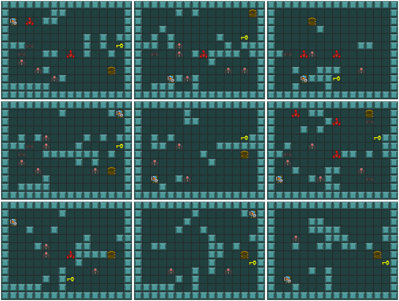
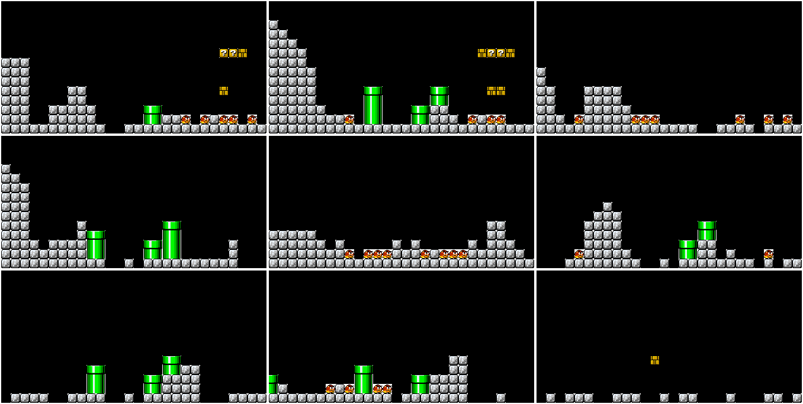
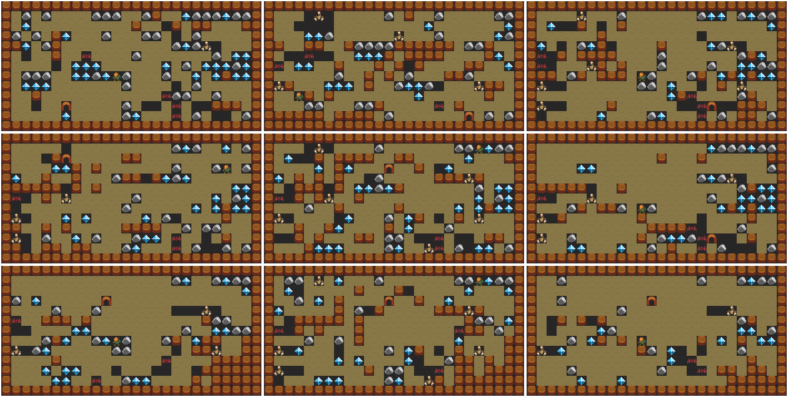

# GVGAI-GAN
[Takata, S.; Sei, Y.; Tahara, Y. and Ohsuga, A. (2023). Diverse Level Generation for Tile-Based Video Game using Generative Adversarial Networks from Few Samples. In Proceedings of the 15th International Conference on Agents and Artificial Intelligence](https://www.scitepress.org/Link.aspx?doi=10.5220/0011666200003393)

# Samples
## Zelda

## Mario

## Boulderdash

